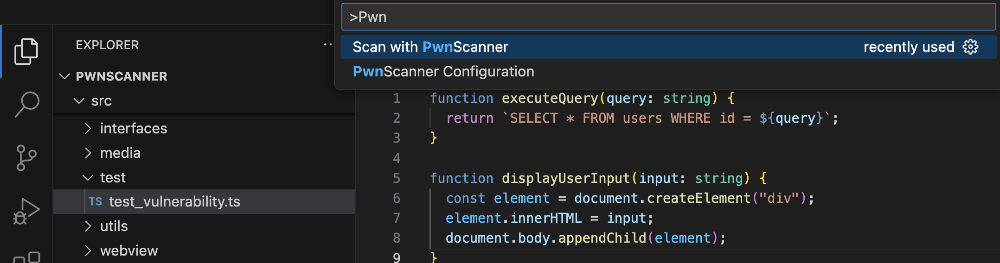
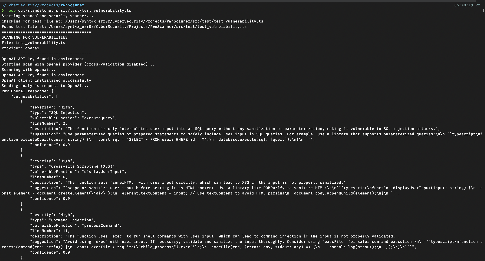
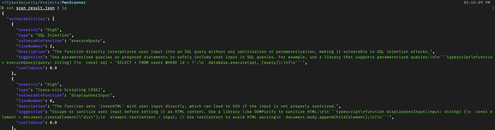
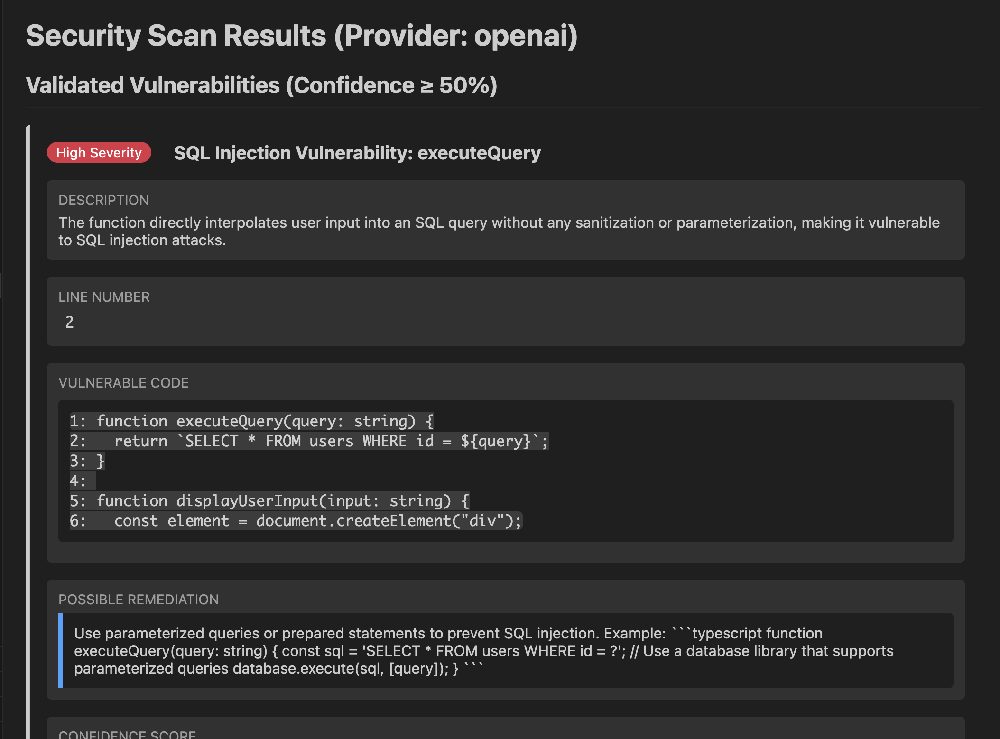
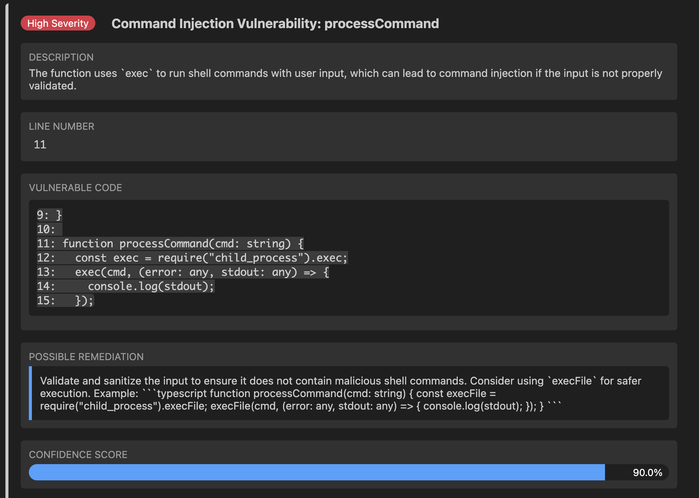
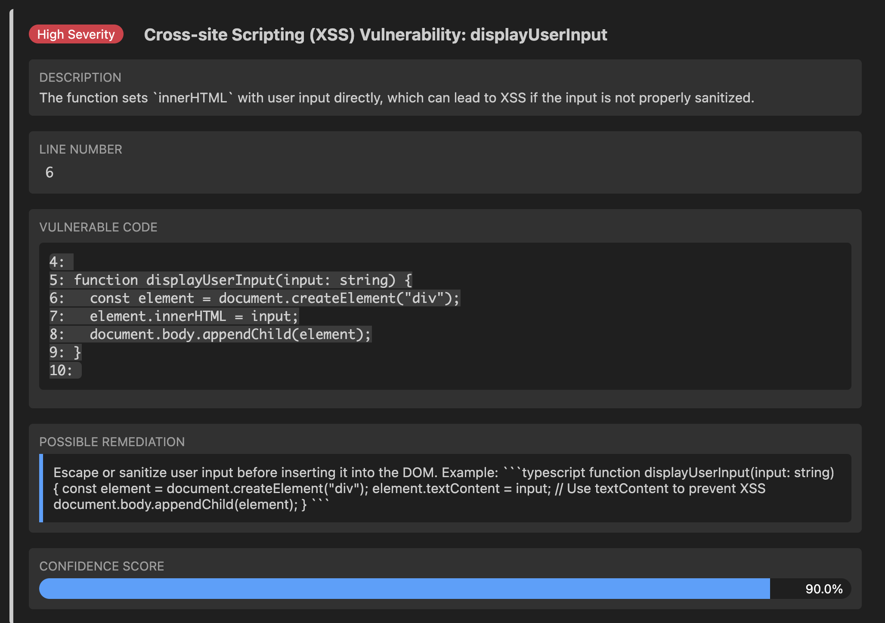

# PwnScanner

A powerful VS Code extension for AI-powered code vulnerability scanning with comprehensive reporting features.

## What It Does

The VS Code Security Scanner identifies potential security vulnerabilities in your code by leveraging advanced AI models. It analyzes your code for common security issues such as:

- SQL Injection
- Cross-site Scripting (XSS)
- Command Injection
- Insecure Cryptography
- Business Logic Flaws
- Race Conditions
- And more...

## Features

- **Multi-Provider AI Analysis**: Scan with multiple AI providers (OpenAI, Claude, Grok) for enhanced accuracy
- **Cross-Validation**: Combine results from multiple AI providers to reduce false positives
- **Confidence-Based Categorization**: Vulnerabilities are classified as Validated (≥50% confidence) or Unconfirmed (<50%)
- **Rich Visualization**: Detailed vulnerability reports with severity indicators, code snippets, and remediation suggestions
- **Comprehensive Reporting**: Generate reports in multiple formats (HTML, PDF, and Markdown)
- **Standalone Scanner**: Run vulnerability scans outside of VS Code using the command line interface
- **Code Context Recognition**: Identify vulnerable functions, line numbers, and associated code snippets

## How It Works

1. The extension analyzes your code using AI-powered language models trained to identify security vulnerabilities
2. Each potential vulnerability is assigned a confidence score based on the AI's analysis
3. Results are categorized and displayed in an interactive panel with detailed information
4. Optional cross-validation can be enabled to compare results from multiple AI providers
5. Reports can be generated in multiple formats for documentation and sharing

## Requirements

- Visual Studio Code 1.60.0 or higher
- Node.js 14.0.0 or higher
- An API key for at least one of the supported AI providers:
  - OpenAI (GPT-4 or later)
  - Anthropic Claude (optional)
  - Grok AI (optional)

## Installation

### From VS Code Marketplace

1. Install the extension from the VS Code Marketplace by Searching PwnScanner
2. Run the "PwnScanner Configuration" command from the command palette for API Configuration
3. Open a file you want to scan
4. Run the "Scan with PwnScanner" command from the command palette



### Manual Installation

1. Download the latest `.vsix` file from the releases page
2. In VS Code, open the Command Palette (Ctrl+Shift+P / Cmd+Shift+P)
3. Run "Extensions: Install from VSIX..." and select the downloaded file
4. Run the "PwnScanner Configuration" command from the command palette for API Configuration
5. Restart VS Code if prompted
6. Open a file you want to scan
7. Run the "Scan with PwnScanner" command from the command palette

   

## Building the Extension

To build the extension from source, follow these steps:

1. Clone the repository:

   ```bash
   git clone https://github.com/Mdrasel1230/PwnScanner.git
   ```

2. Navigate to the project directory:

   ```bash
   cd PwnScanner
   ```

3. Install dependencies:

   ```bash
   npm install
   ```

4. Compile TypeScript:

   ```bash
   npx tsc
   ```

5. Package the extension into a VSIX file:

   ```bash
   npx vsce package --allow-missing-repository --no-yarn
   ```

This will create a `.vsix` file in the root directory that can be installed in VS Code using the "Install from VSIX..." command.

## Usage

### Basic Scanning

1. Open a file in VS Code
2. Access the Command Palette (Ctrl+Shift+P / Cmd+Shift+P)
3. Run "Scan with PwnScanner"

   

4. Review the results in the Security Scanner panel

### Configuration Options

- **Select AI Provider**: Choose which AI provider to use for scanning
- **Enable Cross-Validation**: Toggle to compare results from multiple providers
- **Generate Reports**: Create HTML, PDF or Markdown reports for documentation

### Standalone Scanner

The extension includes a standalone scanner that can be run from the command line without VS Code:

```bash
git clone https://github.com/Mdrasel1230/PwnScanner.git

cd PwnScanner

npm install

# Setting up API Keys
export OPENAI_API_KEY="your-openai-api-key"
export CLAUDE_API_KEY="your-claude-api-key"  # Optional
export GROK_API_KEY="your-grok-api-key"      # Optional

# Build and run the standalone scanner

npx tsc && node out/standalone.js

```

This will use the default test file, but you can also specify a custom file to scan:

```bash
# Scan a specific file
node out/standalone.js path/to/your/file.js
```

## Standalone Scanner Results



## JSON Formatted Results



## VS Code PwnScanner Extension Scan Results







## Privacy and Security

- Your code is sent to the selected AI provider for analysis
- API keys are stored securely in the VS Code secrets storage
- No data is permanently stored on external servers
- All analysis happens on-demand when you initiate a scan

## Troubleshooting

### Common Issues

1. **API Key Not Found**

   If you encounter "API key not found" errors:

   ```bash
   # Make sure you've configured the API key in VS Code settings or exported it as an environment variable:
   export OPENAI_API_KEY="your-openai-api-key"
   ```

2. **TypeScript Compilation Errors**

   If you encounter compilation errors:

   ```bash
   # Make sure TypeScript is installed
   npm install typescript --save-dev

   # Clear the output directory and recompile
   rm -rf ./out
   npx tsc
   ```

3. **VSIX Package Creation Issues**

   If you have issues creating the VSIX package:

   ```bash
   # Try with explicit parameters
   npx vsce package --allow-missing-repository --no-yarn
   ```

### Getting Help

If you encounter any issues not listed here, please open an issue in the GitHub repository with:

- The exact error message
- Steps to reproduce the issue
- Your environment details (OS, Node.js version, VS Code version)

## License

This project is licensed under the MIT License - see the LICENSE file for details.
